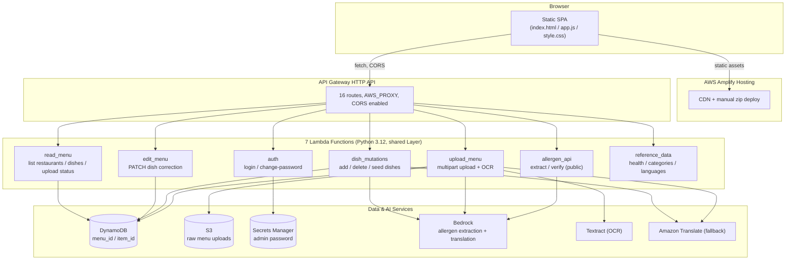

# AI Allergen Compliance Demo

An AI system that helps cafes and restaurants publish allergen-accurate, multilingual menus. Staff upload a menu (PDF/image) or add dishes by hand; the system runs OCR, extracts allergens with a Bedrock LLM cross-checked against a deterministic FSANZ Standard 1.2.3 rules engine, verifies compliance, and translates each dish into Spanish, German, Japanese, and Mandarin. Diners pick a cafe and browse its menu in their language with clear "Contains …" allergen tags; staff log in to review and correct the AI's output (human-in-the-loop).

Fully serverless: every backend route is a Lambda function behind an API Gateway HTTP API, the frontend is static and hosted on AWS Amplify, and infrastructure is Terraform with remote state in S3 + DynamoDB locking. Deployed via GitHub Actions on every push to `main`.

## Architecture



Everything lives in one AWS region (`ap-southeast-2` by default) and one account. There is no EC2, no Elastic Beanstalk, and no Cognito — auth is a single shared admin credential stored in Secrets Manager (see [Known limitations](#known-limitations)).

## The allergen pipeline (with optional RAG)

Allergen handling lives in two collaborating pieces, both in `app/services/` and bundled into the shared Lambda Layer:

- `allergen_rules.py` — the deterministic FSANZ Standard 1.2.3 rules engine (`PEAL_CATEGORIES`, `scan_text_for_allergens`, `to_display_tags`, `derive_diet_tags`).
- `allergen_service.py` — combined extraction + compliance. Keyword extraction, Bedrock-LLM extraction reconciled with the rules engine, a deterministic NZ PEAL compliance verdict (`COMPLIANT` / `ACTION_REQUIRED` / `UNVERIFIED`), and RAG retrieval of regulatory context. `verify_pipeline()` takes the **union** of three signals — LLM categories, rules-engine categories, RAG-retrieved categories — as the confirmed allergen set (biased toward not under-declaring).

`services/pipeline_service.py` runs this chain (analyze → verify → translate) for every dish, called identically by `dish_mutations` (manual add, seed) and `upload_menu` (per parsed dish) so the two entry points can never drift apart.

**RAG is opt-in and off by default.** `retrieve_context()` uses a Bedrock Knowledge Base only when `KNOWLEDGE_BASE_ID` is set; otherwise it degrades to a local search over the small `docs/*.md` files bundled into the Lambda Layer, so the pipeline never hard-fails without a KB. The Knowledge Base infrastructure in `terraform/bedrock_kb.tf` is entirely gated behind `var.create_knowledge_base` (default **false**).

## Restaurant registry pattern

A restaurant's existence is its own dedicated **registry row**, independent of its dishes:

```json
{ "menu_id": "<restaurantId>", "item_id": "restaurant#<restaurantId>", "record_type": "restaurant", "name": "<Display Name>" }
```

`GET /restaurants` returns restaurants by scanning for these registry rows, **not** by inferring them from dish rows — so a restaurant with zero dishes still appears in the picker as long as its registry row exists. `GET /menus/{restaurantId}` excludes both the `restaurant#` registry row and the `upload#` status sentinel so only real dish rows are returned.

Creating a restaurant is currently manual/CLI-only — see [DEPLOY_GUIDE.md](DEPLOY_GUIDE.md#4-seed-a-restaurant-registry-row).

## API endpoints

| Function | Route | Auth |
|---|---|---|
| `read_menu` | `GET /restaurants` | public |
| `read_menu` | `GET /menus/{restaurantId}` | public |
| `read_menu` | `GET /menus/{uploadId}/status` | public |
| `edit_menu` | `PATCH /menus/{menuId}/items/{itemId}` | admin bearer token |
| `auth` | `POST /auth/login` | public |
| `auth` | `POST /auth/change-password` | admin bearer token |
| `dish_mutations` | `POST /menus/{menuId}/items` | admin bearer token |
| `dish_mutations` | `DELETE /menus/{menuId}/items/{itemId}` | admin bearer token |
| `dish_mutations` | `DELETE /menus/{menuId}` | admin bearer token |
| `dish_mutations` | `POST /menus/{menuId}/seed` | admin bearer token |
| `upload_menu` | `POST /menus/{menuId}/upload` (multipart) | admin bearer token |
| `allergen_api` | `POST /allergens/extract` | public |
| `allergen_api` | `POST /compliance/verify` | public |
| `reference_data` | `GET /health` | public |
| `reference_data` | `GET /allergen-categories` | public |
| `reference_data` | `GET /languages` | public |

Auth is a single shared admin credential enforced *inside* each handler (`services/auth_service.py`), not by an API Gateway authorizer — see [Known limitations](#known-limitations).

## The UI

The frontend (`app/static/index.html`, `app.js`, `style.css`; Bootstrap 5.3.3 via CDN plus a custom warm palette) is a single page with two states:

- **Cafe picker** — the first screen; lists cafes from `GET /restaurants` as buttons.
- **Main app** — a sticky header (brand, display-language selector for EN/ES/DE/JA/ZH, "Change cafe", "Login as Admin" / "Logout") and a dish grid with allergen "Contains …" chips, diet-tag filter checkboxes, and (logged in) a management panel for upload / manual add / clear dishes / change password.

`app/static/config.js` holds `window.API_BASE_URL`, generated at deploy time from `terraform output menu_api_invoke_url` — the frontend calls the API cross-origin (Amplify domain → API Gateway domain), never same-origin.

## Deploying

Full instructions, prerequisites, and command-by-command steps are in **[DEPLOY_GUIDE.md](DEPLOY_GUIDE.md)**. Short version:

1. `python3 build/build_layer.py` — package the shared services into the Lambda Layer.
2. `cd terraform && terraform init && terraform apply` — provisions everything (Lambdas, API Gateway, DynamoDB, S3, Secrets Manager, Amplify app).
3. Write `terraform output menu_api_invoke_url` into `app/static/config.js`, zip `app/static/`, and deploy it to Amplify (manual `aws amplify create-deployment` / `start-deployment` — no git-connected Amplify app in this demo).
4. Seed at least one restaurant registry row (DynamoDB `put-item`) so the cafe picker has something to show.

CI/CD (`.github/workflows/deploy.yml`) does steps 1–3 automatically on every push to `main`, authenticating to AWS via GitHub OIDC (no stored AWS keys). PRs run `terraform plan` only.

## Known limitations

- **Single shared admin credential, no per-user auth.** One password (Secrets Manager, rotatable via the app's own "Change Password" action) guards every mutating route — not a Cognito/JWT-based per-user identity.
- **Upload size capped at 4MB.** A synchronous Lambda invocation payload is capped at 6MB, and base64 inflates a file ~33% — a production version would upload straight to S3 via a presigned URL and process asynchronously.
- **CORS is wide open (`allow_origins = ["*"]`)** on the API Gateway HTTP API, to avoid a circular dependency on the not-yet-known Amplify domain at first `apply`. Fine for a public demo with header-based (not cookie-based) auth.
- **The Bedrock Knowledge Base is opt-in**, off by default; RAG falls back to local `docs/*.md` search.
- **Amplify has no connected git repository** in this demo — every frontend deploy is a manual (or CI-scripted) zip upload, not an Amplify-native build-on-push.

## Next steps

1. Real per-user auth (Cognito User Pool + JWT authorizer on the mutating routes), if multi-user access is needed.
2. Presigned-URL direct-to-S3 upload + async processing, to remove the 4MB cap.
3. Tighten CORS to the actual Amplify domain once it's known.
4. An admin UI for restaurant registry creation, so rows aren't hand-seeded via the CLI.
