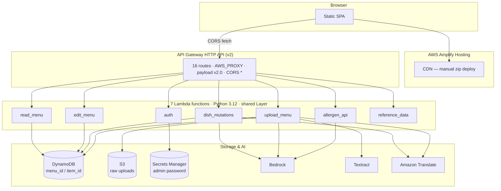
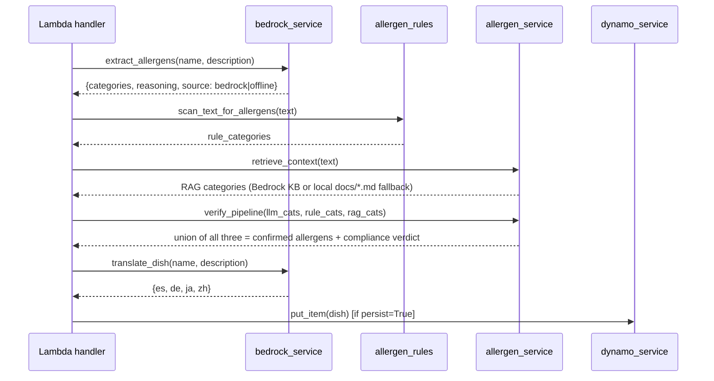
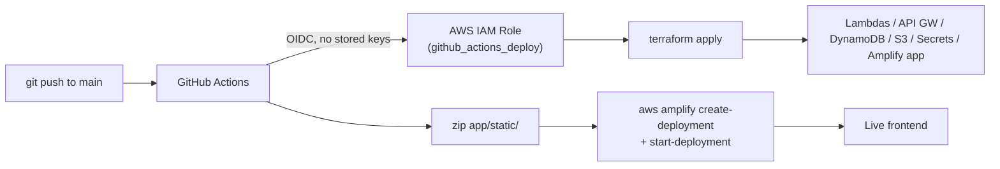

# Technical Design Document — AI Allergen Compliance Demo

| | |
|---|---|
| **Project** | ai-allergen-compliance-demo |
| **Region** | ap-southeast-2 (Sydney) |
| **AWS Account** | 669232219904 |
| **Status** | Live |

## 1. Purpose & Scope

A serverless system that lets cafe/restaurant staff publish allergen-accurate, multilingual menus with minimal manual effort, and lets diners browse those menus safely in their own language. This document describes the current, deployed architecture: 7 AWS Lambda functions behind an API Gateway HTTP API, a static frontend on AWS Amplify Hosting, DynamoDB + S3 for storage, Secrets Manager for the admin credential, and Bedrock/Textract/Translate for the AI pipeline.

Out of scope for this revision (see §9, Known Limitations & Future Work): per-user authentication, direct-to-S3 presigned uploads, and a Bedrock Knowledge Base (built but opt-in/off).

## 2. Goals & Non-Goals

**Goals**
- Every write path (menu edits, uploads, seeding) runs the same deterministic + LLM allergen pipeline, so there is exactly one source of truth for "what does this dish contain."
- Infrastructure-as-code, remote state, and CI/CD from day one — no manual console changes drift from what's in git.
- Least-privilege IAM per Lambda function (each function's execution role only grants the AWS actions its own handler code calls).
- A demo that a non-technical reviewer can operate end-to-end (cafe picker → browse → admin login → upload/add a dish → see it appear, translated, with allergen tags).

**Non-Goals (this revision)**
- Real per-user authentication / authorization.
- Handling uploads larger than ~4MB.
- Multi-region high availability.
- Automated regression/integration test suite running in CI (tests exist under `build/*/test_*.py` and `tests/` but are not yet wired into the GitHub Actions workflow).

## 3. Architecture Overview



### 3.1 Why this shape

- **HTTP API, not REST API** (API Gateway) — lower cost, lower latency, and payload-format-2.0 proxy integrations map cleanly onto the existing readMenu/editMenu handler contracts that predate this migration.
- **One Lambda per cohesive concern, not one per route.** 7 functions rather than 16 keeps related logic (all dish-mutation writes; all read-only GETs) co-located and sharing one execution role's permission set, while still keeping unrelated concerns (auth, OCR/upload, pure analysis) in separate, independently-scoped functions.
- **A single shared Lambda Layer** (`build/layer/`) holds every `app/services/*.py` module byte-for-byte, plus the small `docs/*.md` regulatory files the RAG fallback reads. Every function imports the same, unmodified service code — there is no per-function copy that can drift.
- **Everything in one region.** The predecessor (Elastic Beanstalk) deployment split DynamoDB/S3 into `us-east-1` while Bedrock stayed in `ap-southeast-2` for latency reasons specific to a single EC2 instance calling both. A serverless rebuild has no such constraint, so this design keeps DynamoDB, S3, every Lambda, and Bedrock in one region — simpler operationally, and it removes a whole class of "wrong region" bugs (two of which were found and fixed during this migration; see §8).

## 4. Data Model

Single DynamoDB table, `menu_id` (partition key) + `item_id` (sort key), `PAY_PER_REQUEST` billing.

| `item_id` shape | `record_type` | Represents |
|---|---|---|
| `restaurant#<id>` | `restaurant` | Registry row — a restaurant's existence, independent of its dishes |
| `upload#<id>` | `upload_status` | Status-polling sentinel for an async upload (contract exists; not currently written by `upload_menu`, see §9) |
| `dish-<hex>` | *(absent)* | A dish, the pipeline's output |

A dish row:

```json
{
  "menu_id": "kiwi-cafe-auckland",
  "item_id": "dish-a1b2c3d4",
  "name": "...", "description": "...",
  "source": "manual | upload | sample",
  "status": "ai_verified | human_verified",
  "allergens": {
    "confirmed": ["Milk", "Gluten (Cereals)"],
    "display_tags": ["Contains Milk", "Contains Wheat/Gluten"],
    "llm_reasoning": "...", "llm_source": "bedrock | offline",
    "disagreements": {"llm_only": [], "rule_only": [], "rag_only": []},
    "rag_citations": [{"category": "...", "source": "...", "section": "...", "text": "..."}],
    "compliance": {"engine": "...", "rag_categories": [...], "reasoning": "..."}
  },
  "diet_tags": ["Gluten-Free"],
  "translations": {"es": {...}, "de": {...}, "ja": {...}, "zh": {...}},
  "updated_at": 1789253036
}
```

`GET /restaurants` (Scan filtered on `record_type == "restaurant"`) and `GET /menus/{restaurantId}` (Query on `menu_id`, filtering out the registry row and upload sentinel) are the two read shapes; every other route reads/writes a single item by key.

## 5. The Allergen Pipeline

`services/pipeline_service.run_pipeline(menu_id, name, description, source, persist=True)` is the single call site used by both `dish_mutations` (manual add, seed) and `upload_menu` (per OCR-parsed dish):



**Design decision: union, not intersection.** `verify_pipeline()` takes the union of LLM, rules-engine, and RAG-derived categories as the confirmed set — biased toward *not under-declaring* an allergen, which is the correct failure mode for a food-safety system (a false positive is an inconvenience; a false negative is a health risk).

**Graceful degradation at every AI call:**
- Bedrock extraction fails → keyword-rule fallback (`llm_source: "offline"`).
- Bedrock translation fails → Amazon Translate fallback → offline stub labelled `[<lang> - offline]` as a last resort.
- No Bedrock Knowledge Base configured → local keyword search over the bundled `docs/*.md` files, never a hard failure.

## 6. Lambda Functions & IAM

Each function's execution role grants **only** the AWS actions its own handler code calls (see `terraform/lambda_iam.tf`) — verified against the actual `import`/API-call sites in each handler, not granted by convention.

| Function | Memory / Timeout | IAM grants | Notes |
|---|---|---|---|
| `read_menu` | 128MB / 10s | DynamoDB Get/Query/Scan | Public. Reused verbatim from a pre-existing, independently unit-tested build. |
| `edit_menu` | 128MB / 10s | DynamoDB UpdateItem only | Admin bearer token checked in-handler (moved here from the API Gateway JWT authorizer this reused code originally shipped with — see §9). |
| `auth` | 128MB / 10s | Secrets Manager Get/PutSecretValue (scoped to the one secret ARN) | Only function with Secrets Manager access. |
| `dish_mutations` | 512MB / 29s | DynamoDB Put/Delete/BatchWrite/Query, Bedrock Invoke, Translate | Timeout at 29s — one below API Gateway HTTP API's hard 30s integration ceiling, so a slow Bedrock call surfaces as a clean gateway timeout rather than an ambiguous Lambda-side one. |
| `upload_menu` | 512MB / 29s | S3 Put/GetObject (uploads prefix only), Textract, DynamoDB PutItem, Bedrock, Translate | Parses `multipart/form-data` via Python's `email` package (a synthetic MIME header prepended to the base64-decoded body) rather than a hand-rolled boundary parser. |
| `allergen_api` | 128MB / 20s | Bedrock Invoke only | No DynamoDB/S3 — pure analysis, matches the public `docs/allergen-api.md` external contract. |
| `reference_data` | 128MB / 10s | none (logs only) | Static/near-static GETs. |

**Auth model.** A single shared admin credential (`services/auth_service.py`), not per-user identity. `POST /auth/login` compares against a password stored in Secrets Manager; a correct login returns a fixed bearer token, checked by every mutating handler. `POST /auth/change-password` rotates the Secrets Manager value directly (`PutSecretValue`) — no redeploy needed to change the password, and Terraform's `ignore_changes` on the secret's value means a later `apply` never stomps a rotated password back to its seed value.

## 7. Deployment & CI/CD



- **Terraform remote state**: S3 bucket + DynamoDB lock table, provisioned once by `terraform/bootstrap/` — its own separate root module/state, because a backend's storage can't sanely live inside the state it stores (the classic bootstrapping problem).
- **GitHub OIDC**: `terraform/github_oidc.tf` creates an OIDC identity provider trusting `token.actions.githubusercontent.com` and an IAM role whose trust policy is scoped to one exact GitHub repo. No AWS access key is stored in GitHub at all.
- **PRs plan-only; pushes to `main` apply + deploy.** A workflow run from any other repo/fork can never assume the role regardless of what it requests.
- **Amplify has no connected git repository.** There is no GitHub remote wired into Amplify's own build system in this demo, so both the CI workflow and a manual local deploy use the same mechanism: zip `app/static/`, `create-deployment`, upload to the returned presigned S3 URL, `start-deployment`, poll for `SUCCEED`.

## 8. Migration Notes (from the prior Elastic Beanstalk build)

This project began as a copy of a Flask-on-Elastic-Beanstalk demo. Two real bugs were found and fixed during the serverless rewrite, both instructive enough to record here:

1. **Import-order env var bug.** The Beanstalk app loaded Lambda-style handler modules *before* setting the DynamoDB table name environment variables the handlers read at import time — so the table name constant always latched onto `""`, and every DynamoDB call failed with `ParamValidationError`. Lambda doesn't have this hazard (the platform sets environment variables before the runtime even starts), but the equivalent mistake resurfaced once during this migration anyway: `read_menu`'s dish-listing route uses `services/dynamo_service.py`, which reads `DYNAMODB_TABLE`, while its other two routes read `MENU_TABLE_NAME` directly — the Lambda's `environment` block in Terraform originally set only the latter. Fixed by setting both names to the same table on every function that touches DynamoDB.
2. **Invalid Bedrock model ID.** The chosen cross-region inference profile (`apac.anthropic.claude-haiku-4-5-20251001-v1:0`) does not exist — `aws bedrock list-inference-profiles` in `ap-southeast-2` showed only `apac.anthropic.claude-3-haiku-...`, `au.anthropic.claude-haiku-4-5-...`, and `global.anthropic.claude-haiku-4-5-...`. Switched to the `global.` profile, which matches the original deployment's model and is valid from any region.

## 9. Known Limitations & Future Work

| Limitation | Why it exists | What "done properly" looks like |
|---|---|---|
| Single shared admin credential | Matches the original app's scope exactly; Cognito was deployed-but-unused in the predecessor project and was dropped rather than carried forward unwired | Cognito User Pool + Hosted UI/Amplify Auth, JWT authorizer on every mutating route |
| Upload capped at ~4MB | A synchronous Lambda invocation payload is capped at 6MB, and base64 inflates a file ~33% | Browser uploads directly to S3 via a presigned URL; Lambda processes async off an S3 event, writing the `upload#` status sentinel `read_menu` already expects but nothing currently produces |
| CORS `allow_origins = ["*"]` | The Amplify domain isn't known until after the first `apply` — avoiding a circular dependency | Tighten to the exact Amplify domain (or custom domain) once fixed |
| Bedrock Knowledge Base opt-in, off by default | Matches original scope; RAG's local-docs fallback is judged sufficient for a demo | Set `var.create_knowledge_base = true`, ingest the full regulatory PDFs in `docs/` |
| No automated tests in CI | Existing `build/*/test_*.py` / `tests/` suites predate this migration and were not re-wired into `.github/workflows/deploy.yml` | Add a `pytest` job before `terraform apply` |
